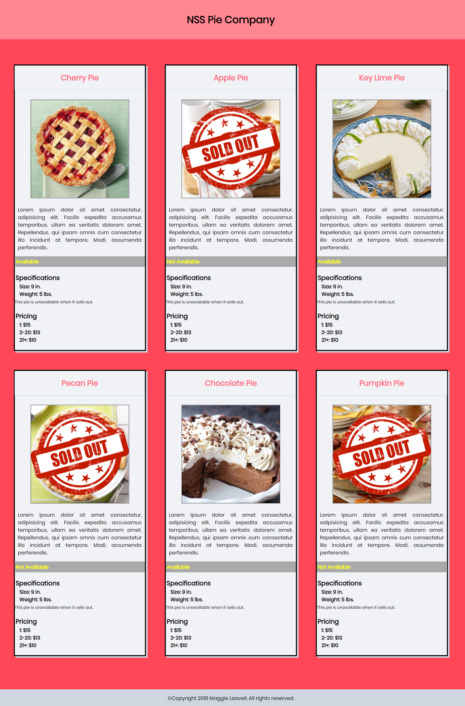

# Study Group Assignment 1

## Description
The goal of this assingnment was to build a grid of cards for a company's product. To view specific assignment details, click [here.](https://github.com/nss-nightclass-projects/exercise-vault/blob/master/HTML_CSS_product_cards.md)

## Screenshots


## How to run this project
* Use npm to install http-server in your terminal:
```sh
npm install -g http-server
```
* Run the server in your terminal
```sh
hs -p 9999
```
* Open chrome and navigate to:
```
localhost:9999
```

## Contributors
[Maggie Leavell](https://github.com/mjleavell)